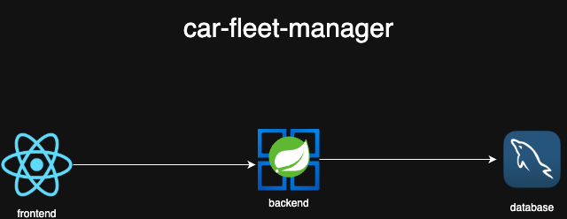

# Car Fleet Manager API

Sistema de gerenciamento de frotas de veículos com cadastro completo, busca avançada, estatísticas detalhadas e exercícios de lógica de programação.

[](https://sonarcloud.io/summary/new_code?id=souluanf_car-fleet-manager)
[](https://sonarcloud.io/summary/new_code?id=souluanf_car-fleet-manager)
[](https://sonarcloud.io/summary/new_code?id=souluanf_car-fleet-manager)
[](https://sonarcloud.io/summary/new_code?id=souluanf_car-fleet-manager)
[](https://sonarcloud.io/summary/new_code?id=souluanf_car-fleet-manager)
[](https://sonarcloud.io/summary/new_code?id=souluanf_car-fleet-manager)
[](https://sonarcloud.io/summary/new_code?id=souluanf_car-fleet-manager)
[](https://sonarcloud.io/summary/new_code?id=souluanf_car-fleet-manager)
[](https://sonarcloud.io/summary/new_code?id=souluanf_car-fleet-manager)
[](https://sonarcloud.io/summary/new_code?id=souluanf_car-fleet-manager)
[](https://sonarcloud.io/summary/new_code?id=souluanf_car-fleet-manager)

## Sumário

- [Arquitetura](#arquitetura)
- [Funcionalidades](#funcionalidades)
- [Tecnologias](#tecnologias)
- [Frontend](#frontend)
- [API Documentation](#api-documentation)
- [Requisitos](#requisitos)
- [Configuração](#configuração)
- [Execução](#execução)
- [Estrutura do Projeto](#estrutura-do-projeto)
- [Contato](#contato)

## Arquitetura



A aplicação segue uma arquitetura de microserviços com três componentes principais:
- **Frontend (React):** Interface de usuário desenvolvida em React
- **Backend (FastAPI/Python):** API REST moderna e performática
- **Database (MySQL):** Banco de dados relacional para persistência

### Princípios de Desenvolvimento
- **DDD (Domain-Driven Design):** Organização em camadas (Router → Service → Repository) com separação clara de responsabilidades
- **Clean Code:** Código limpo, legível e bem documentado com nomenclatura expressiva
- **SOLID:** Aplicação dos princípios de design orientado a objetos
- **Type Safety:** Utilização extensiva do Pydantic para validação e serialização de dados

### Otimizações Futuras

Para cenários com grande volume de dados, o sistema está preparado para evoluir com:
- **Query Optimization:** Queries SQL otimizadas com SQLAlchemy para desempenho em operações de leitura
- **Pagination:** Suporte nativo para paginação em endpoints de listagem
- **Caching:** Implementação de cache com Redis para dados frequentemente acessados
- **Indexação:** Índices estratégicos no banco de dados para otimizar buscas
- **Async/Await:** Suporte assíncrono do FastAPI para operações I/O bound

> **Nota:** Atualmente, devido ao volume reduzido de dados, optou-se por uma implementação mais simples e direta, mantendo o código limpo e de fácil manutenção.

## Funcionalidades

### Gerenciamento de Veículos
- **CRUD Completo:** Criar, listar, atualizar (completo e parcial) e excluir veículos
- **Busca Avançada:** Filtrar veículos por nome, marca, ano e cor
- **Campos:** Veículo, marca, ano, descrição, cor e status de venda
- **Validações:** Validação de dados com Pydantic

### Estatísticas e Relatórios
- **Dashboard de Estatísticas:** Total de veículos, vendidos e disponíveis
- **Veículos Cadastrados na Semana:** Lista de veículos recém-cadastrados
- **Distribuição por Década:** Quantidade de veículos agrupados por década de fabricação
- **Distribuição por Fabricante:** Quantidade de veículos por marca

### Exercícios de Lógica
- **Cálculo de Votos:** Calcula percentuais de votos válidos, brancos e nulos
- **Bubble Sort:** Ordenação de vetores utilizando algoritmo Bubble Sort
- **Fatorial:** Cálculo de fatorial de números naturais
- **Múltiplos:** Verifica se número é múltiplo de 3 ou 5

## Tecnologias

### Backend
- Python 3.11+
- FastAPI 0.115.5
- SQLAlchemy 2.0.36
- Pydantic 2.10.3
- Uvicorn (ASGI server)
- PyMySQL

### Banco de Dados
- MySQL 8.0

### Documentação
- OpenAPI 3.1.0 (integrado ao FastAPI)
- Swagger UI (automático)
- ReDoc (automático)

### DevOps
- Docker
- Docker Compose

## Frontend

### Acesso
- **URL:** [http://localhost:3000](http://localhost:3000)

### Telas Disponíveis

#### 🚗 Gerenciamento de Veículos
- **Listagem de Veículos:** Tabela completa com todos os veículos cadastrados
- **Filtros Avançados:** Busca por nome, marca, ano e cor
- **Formulário de Cadastro:** Criação de novos veículos com validação
- **Edição de Veículos:** Atualização de dados de veículos existentes
- **Exclusão:** Remoção de veículos com confirmação
- **Indicador de Status:** Badge visual para veículos vendidos/disponíveis

#### 📊 Estatísticas
- **Cards de Resumo:** Total de veículos, vendidos, disponíveis e cadastrados na semana
- **Gráficos de Distribuição:**
  - Por década de fabricação (gráfico de barras horizontal)
  - Por fabricante (gráfico de barras horizontal)
- **Lista de Veículos Recentes:** Grid com veículos cadastrados nos últimos 7 dias

#### 🧮 Exercícios de Lógica
Interface interativa com 4 exercícios programáticos:
- **Exercício 1 - Votos:** Formulário para cálculo de percentuais eleitorais
- **Exercício 2 - Bubble Sort:** Input de vetor e visualização da ordenação
- **Exercício 3 - Fatorial:** Cálculo com exibição do resultado
- **Exercício 4 - Múltiplos:** Verifica múltiplos de 3 e 5

### Tecnologias do Frontend
- React 18
- JavaScript (ES6+)
- React Router DOM v6
- Axios para requisições HTTP
- CSS3 com design responsivo
- Navegação SPA (Single Page Application)

## API Documentation

A documentação interativa da API está disponível automaticamente através do FastAPI:

- **Swagger UI:** [http://localhost:8080/car-fleet-manager/swagger-ui](http://localhost:8080/car-fleet-manager/swagger-ui)

## Requisitos

- Python 3.11+
- Docker & Docker Compose
- MySQL 8.0 (via Docker)

## Configuração

### 1. Clonar o repositório

```bash
git clone https://github.com/souluanf/car-fleet-manager-py.git
cd car-fleet-manager-py
```

## 3. Execução

Execute o comando abaixo na raiz do projeto:

```bash
cp example.env .env
```


```bash
docker-compose up -d
```

Isso irá subir:
- MySQL na porta 3306
- Backend (FastAPI) na porta 8000
- Frontend (React) na porta 3000


## Contato

Para suporte ou feedback:

- **Nome:** Luan Fernandes
- **Email:**  [contact@luanfernandes.dev](mailto:contact@luanfernandes.dev)
- **LinkedIn:** [https://linkedin.com/in/souluanf](https://linkedin.com/in/souluanf)
